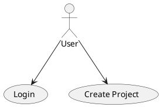

# CaseCraft — Software Modeling Tool

**Software Development Project 2026**

CaseCraft is a web-based software engineering tool designed to help users create, organize and manage software modeling artifacts in a clean and structured workspace.

The application allows users to manage projects, define actors, write use cases, create CRC cards and generate diagram scripts using **PlantUML** or **Nomnoml**. It is built as a full-stack Spring Boot application with Thymeleaf templates, Spring Security authentication and a responsive user interface.

---

## Overview

CaseCraft focuses on supporting the early stages of software design and requirements analysis.

Instead of keeping software engineering artifacts scattered across separate documents, the application provides a central workspace where each project can contain:

- Actors
- Use cases
- CRC cards
- Generated use case diagram scripts
- Generated class diagram scripts

The main goal of the project is to provide a simple and practical tool for organizing software requirements and design elements, while also demonstrating clean software architecture, authentication, CRUD operations and diagram generation strategies.

---

## Features

### User Authentication

CaseCraft supports user registration, login and logout using Spring Security.

Each authenticated user can access and manage only their own projects.

Main authentication features:

- User registration
- Secure login
- Logout functionality
- Profile update support
- Protected project pages

---

### Project Management

Users can create and manage multiple software engineering projects.

Supported project operations:

- Create a new project
- View all user projects
- Open project details
- Edit project name and description
- Delete project
- View dashboard statistics for project-related data

Each project acts as a workspace that contains all related modeling artifacts.

---

### Dashboard Statistics

The main projects page includes dashboard statistic cards showing:

- Total projects
- Total use cases
- Total CRC cards
- Total actors

This gives the user a quick overview of the current workspace.

---

### Project Cards

Projects are displayed as modern project cards instead of a plain table.

Each project card includes:

- Project name
- Project description
- Open project action
- Edit project action
- Delete project action

This provides a cleaner and more dashboard-like user experience.

---

### Actors

Inside each project, users can define actors that interact with the system.

Supported actor operations:

- Add actor
- View project actors
- Delete actor

Actors are later used during use case diagram script generation.

---

### Use Cases

Users can define use cases for each project.

Each use case can contain:

- Name
- Preconditions
- Main flow
- Alternative flow
- Postconditions

Supported use case operations:

- Create use case
- Edit use case
- Delete use case
- View use cases inside the project detail page

Use cases are used as input for generated use case diagram scripts.

---

### CRC Cards

CaseCraft supports CRC card creation for class-based analysis.

Each CRC card can contain:

- Class name
- Responsibilities
- Collaborations

Supported CRC card operations:

- Create CRC card
- Edit CRC card
- Delete CRC card
- Link CRC cards with use cases

CRC cards are used as input for class diagram generation.

---

### Diagram Generation

CaseCraft can generate diagram scripts from project data.

Supported diagram types:

- Use Case Diagram
- Class Diagram

Supported diagram tools:

- PlantUML
- Nomnoml

The generated script can be copied and pasted into the corresponding diagram tool.

This allows users to quickly transform stored project data into visual diagrams.

---

### Tab-Based Project Detail Page

The project detail page uses a tab-based layout to organize project content.

Tabs include:

- Actors
- Use Cases
- CRC Cards
- Diagrams

This avoids long vertical pages and makes the project detail area easier to navigate.

---

### Toast Notifications

The application uses toast notifications to provide user feedback after important actions.

Examples:

- Project created successfully
- Project updated successfully
- Project deleted
- Use case created
- CRC card updated
- Actor deleted
- Invalid login credentials

This improves the overall user experience by replacing plain page messages with modern notifications.

---

### Empty States

CaseCraft includes empty states for pages or sections that do not yet contain data.

For example, when a user has no projects yet, the interface displays a clear message instead of an empty table.

This makes the application feel more complete and user-friendly.

---

## Tech Stack

### Backend

- Java
- Spring Boot
- Spring MVC
- Spring Security
- Spring Data JPA
- Hibernate

### Frontend

- Thymeleaf
- HTML5
- CSS3
- JavaScript

### Database

- MySQL

### Diagram Generation

- PlantUML script generation
- Nomnoml script generation

### Build Tool

- Maven

---

## Application Architecture

The application follows a layered architecture.

```text
Controllers
    ↓
Services
    ↓
Repositories
    ↓
Domain Entities
```

This structure separates responsibilities and keeps the application easier to maintain, extend and test.

---

## Controllers

Controllers handle HTTP requests, form submissions and page rendering.

Main responsibilities:

- Route requests
- Pass data to Thymeleaf templates
- Handle redirects
- Add flash messages for toast notifications

Example controller:

```text
ProjectsController
```

---

## Services

Services contain the main business logic of the application.

Main responsibilities:

- Create and update projects
- Manage use cases
- Manage CRC cards
- Manage actors
- Generate diagram scripts
- Coordinate repository operations

Example service:

```text
ProjectsService
```

---

## Repositories

Repositories handle database access using Spring Data JPA.

Main repositories include:

```text
ProjectRepository
UseCaseRepository
CRCCardRepository
ActorRepository
UserRepository
```

---

## Domain Model

The main domain entities are:

```text
User
Project
Actor
UseCase
CRCCard
```

A user owns projects.

Each project can contain actors, use cases and CRC cards.

---

## Diagram Generation Design

The diagram generation functionality follows a strategy-based design.

This allows the application to support multiple diagram tools without tightly coupling the controller or service logic to a specific output format.

Supported strategies include:

```text
PlantUML Use Case Diagram Generator
Nomnoml Use Case Diagram Generator
PlantUML Class Diagram Generator
Nomnoml Class Diagram Generator
```

This design makes it easier to extend the application in the future with additional diagram formats.

---

## Design Patterns

The diagram generation part of the application is designed around common object-oriented design patterns.

### Strategy Pattern

Different diagram generation tools are handled as interchangeable strategies.

For example:

- PlantUML use case generation
- Nomnoml use case generation
- PlantUML class diagram generation
- Nomnoml class diagram generation

### Template Method Pattern

Abstract generator classes define the common structure of the generation process, while subclasses provide tool-specific output.

### Factory Pattern

Factory classes select the correct generator strategy depending on the selected tool.

This keeps diagram generation flexible, modular and easier to extend.

---

## User Interface

The user interface was designed to be simple, clean and professional.

Main UI elements include:

- Responsive navigation bar
- Login and register pages
- Dashboard statistic cards
- Project cards
- Tab-based project detail page
- Toast notifications
- Empty states
- Copy button for generated diagram scripts
- Footer branding

The interface uses a consistent color palette based on a dark red accent color and neutral backgrounds.

---

## How to Run the Project

### Prerequisites

Before running the project, make sure you have installed:

- Java 17 or newer
- Maven

You can check your Java version with:

```bash
java -version
```

You can check Maven with:

```bash
mvn -version
```

If the project uses the Maven Wrapper, Maven does not need to be installed globally.

---

### Clone the Repository

```bash
git clone https://github.com/your-username/casecraft-software-modeling-tool.git
cd casecraft-software-modeling-tool
```

Replace `your-username` with your actual GitHub username.

---

### Run on Windows

```bash
.\mvnw.cmd clean spring-boot:run
```

---

### Run on Linux / macOS

```bash
./mvnw clean spring-boot:run
```

---

### Open the Application

After the application starts, open:

```text
http://localhost:8080
```

or:

```text
http://localhost:8080/login
```

---

## Typical User Flow

```text
Register a new account
        ↓
Login
        ↓
Create a project
        ↓
Add actors
        ↓
Add use cases
        ↓
Add CRC cards
        ↓
Generate PlantUML or Nomnoml scripts
        ↓
Copy the generated script
        ↓
Paste it into the selected diagram tool
```

---

## Project Structure

A simplified structure of the application is shown below:

```text
src/
 └── main/
     ├── java/
     │   └── com/sdepro2026/SDEPro0_12026/
     │       ├── controllers/
     │       ├── domain/
     │       ├── repositories/
     │       ├── services/
     │       └── generation/
     │           ├── usecase/
     │           └── classdiagram/
     │
     └── resources/
         ├── static/
         │   ├── css/
         │   └── images/
         │
         └── templates/
             ├── fragments/
             ├── projects/
             ├── auth/
             └── profile.html
```

---

## Main Pages

### Login Page

The login page provides access to the application using Spring Security authentication.

### Register Page

The register page allows new users to create an account.

### Projects Page

The projects page works as the main dashboard. It displays project statistics, project cards and the project creation form.

### Project Detail Page

The project detail page contains tabs for actors, use cases, CRC cards and diagram generation.

### Diagram Page

The diagram page displays the generated PlantUML or Nomnoml script and provides a copy button.

### Profile Page

The profile page allows the user to update account information.

---

## Example Generated PlantUML Script



---

## Example Generated Nomnoml Script

```nomnoml
#direction: right
[<actor> User]
[<usecase> Login]
[<usecase> Create Project]
[User] -> [Login]
[User] -> [Create Project]
```

---

## Security

The application uses Spring Security to protect private pages.

Public pages include:

```text
/login
/register
/css/**
/js/**
/images/**
```

Authenticated users can access:

```text
/projects
/profile
/project detail pages
/diagram generation pages
```

Each user can manage their own projects after logging in.

---

## Testing

The project includes tests for the main application layers.

Testing focuses on:

- Domain model behavior
- Repository interaction
- Service logic
- Controller behavior
- Authentication-related flows
- Project and diagram generation workflows

The goal of testing is to verify that the application works correctly across its main features and that the final version is stable.

---

## Future Improvements

Possible future improvements include:

- Direct diagram preview inside the application
- Export diagrams as PNG or SVG
- More advanced project collaboration features
- User roles and permissions
- Search and filter for projects
- Better validation and error handling
- Dark mode
- Deployment to a cloud platform
- REST API support

---

## Educational Purpose

This project was developed as part of a software engineering course assignment.

It demonstrates:

- MVC architecture
- Spring Boot web development
- Authentication with Spring Security
- CRUD operations
- Entity relationships
- Thymeleaf template rendering
- Strategy pattern for diagram generation
- Clean UI design
- Basic user experience improvements

---

## Authors

Developed by **k3rneluser & VoiD**.

---

## License

This project is intended for educational purposes.
