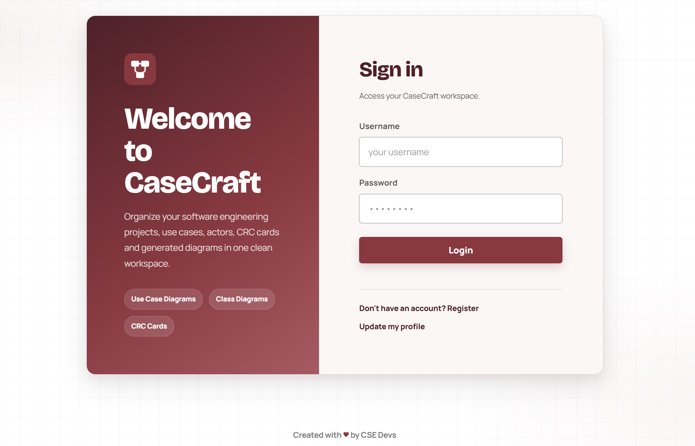
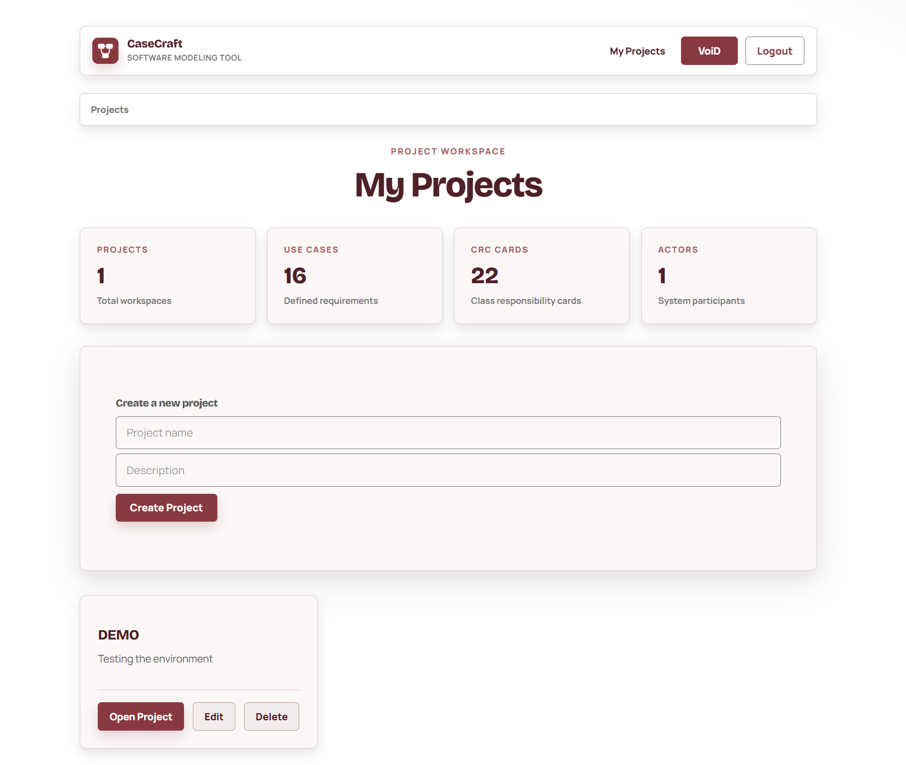
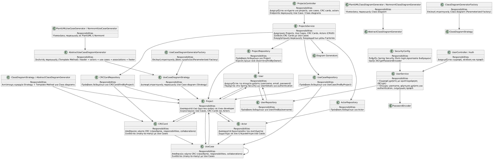
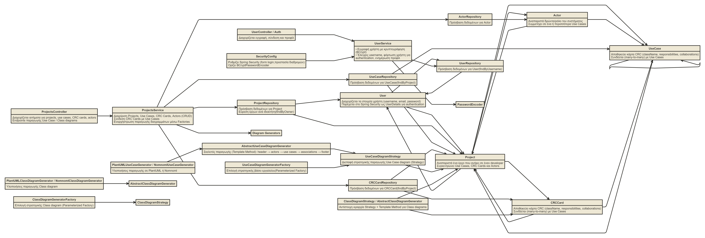
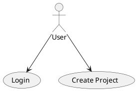

<p align="center">
  
</p>

> A web-based software-modeling workspace for organizing requirements and design artifacts — actors, use cases, and CRC cards — and turning them into ready-to-render **PlantUML** and **Nomnoml** diagram scripts.

<p>
  
  
  
  
  <a href="LICENSE"></a>
</p>

CaseCraft replaces scattered design documents with a single authenticated workspace. Each project groups its actors, use cases, and CRC cards together, and the application generates diagram scripts directly from that data — so the model and its diagrams never drift out of sync.

---

## Table of Contents

- [Features](#features)
- [Tech Stack](#tech-stack)
- [Architecture](#architecture)
- [Getting Started](#getting-started)
- [Configuration](#configuration)
- [Diagram Generation](#diagram-generation)
- [Screenshots](#screenshots)
- [Project Structure](#project-structure)
- [Testing](#testing)
- [Roadmap](#roadmap)
- [Authors](#authors)
- [License](#license)

---

## Features

- **Authentication & isolation** — Registration, login/logout, and profile management via Spring Security. Every user sees and edits only their own projects.
- **Project workspace** — Full CRUD over projects, presented as a card-based dashboard with live statistics (projects, use cases, CRC cards, actors).
- **Modeling artifacts** — Manage **actors**, **use cases** (preconditions, main/alternative flow, postconditions), and **CRC cards** (class, responsibilities, collaborations) per project.
- **Diagram script generation** — Produce **use-case** and **class** diagram scripts in either **PlantUML** or **Nomnoml**, copy them with one click, and paste into your renderer of choice.
- **Polished UI** — Tab-based project detail view, toast notifications, empty states, and a responsive layout on a consistent dark-red accent palette.

---

## Tech Stack

| Layer           | Technologies                                                            |
| --------------- | ----------------------------------------------------------------------- |
| Language        | Java 17                                                                 |
| Framework       | Spring Boot 4.0.3 (Spring MVC, Spring Security, Spring Data JPA)        |
| View            | Thymeleaf + `thymeleaf-extras-springsecurity6`, HTML5, CSS3, JavaScript |
| Persistence     | Hibernate / JPA, MySQL                                                  |
| Diagram engine  | PlantUML 1.2024.3, Nomnoml (script output)                              |
| Build & tooling | Maven (wrapper included), Spring Boot DevTools                          |
| Testing         | JUnit 5, Spring Boot Test, Spring Security Test                         |

---

## Architecture

CaseCraft follows a conventional layered architecture with a clear, one-directional dependency flow:

```
Controllers  ->  Services  ->  Repositories  ->  Domain Entities
 (HTTP/views)   (business)     (Spring Data)      (JPA model)
```

**Domain model:** a `User` owns many `Project`s; each `Project` aggregates `Actor`, `UseCase`, and `CRCCard` entities. Use cases feed use-case diagram generation; CRC cards feed class diagram generation.

### Diagram generation design

Diagram output is decoupled from the controller and service layers so new formats can be added without touching existing code:

- **Strategy** — each tool/diagram combination (PlantUML use case, Nomnoml use case, PlantUML class, Nomnoml class) is an interchangeable generator.
- **Template Method** — abstract generators define the shared generation skeleton; subclasses supply the tool-specific syntax.
- **Factory** — selects the correct generator for the requested tool at runtime.

## Screenshots



<details>
<summary>📸 Show images </summary>





</details>

---

## Getting Started

### Prerequisites

- **JDK 17+** — verify with `java -version`
- **MySQL 8.x** running locally (or reachable)
- Maven is **not** required globally; use the bundled wrapper (`mvnw` / `mvnw.cmd`)

### 1. Clone

```bash
git clone https://github.com/<your-username>/casecraft-software-modeling-tool.git
cd casecraft-software-modeling-tool
```

### 2. Create the database

```sql
CREATE DATABASE sdepro2026;
```

Hibernate is configured with `ddl-auto=update`, so the schema is created/updated automatically on first run.

### 3. Configure credentials

Set your database connection (see [Configuration](#configuration) — prefer environment variables over committing credentials).

### 4. Run

```bash
# Linux / macOS
./mvnw clean spring-boot:run

# Windows
.\mvnw.cmd clean spring-boot:run
```

### 5. Open

Navigate to **http://localhost:8080** — you'll be redirected to the login page. Register an account to get started.

**Typical flow:** register → log in → create a project → add actors, use cases, and CRC cards → generate a PlantUML/Nomnoml script → copy and render.

---

## Configuration

Configured in `src/main/resources/application.properties`. Defaults target a local MySQL instance:

| Property                        | Description         | Default                                  |
| ------------------------------- | ------------------- | ---------------------------------------- |
| `spring.datasource.url`         | JDBC connection URL | `jdbc:mysql://localhost:3306/sdepro2026` |
| `spring.datasource.username`    | DB username         | `root`                                   |
| `spring.datasource.password`    | DB password         | _(set your own)_                         |
| `spring.jpa.hibernate.ddl-auto` | Schema strategy     | `update`                                 |
| `spring.jpa.show-sql`           | Log generated SQL   | `true`                                   |

> **Security note:** do not commit real credentials. Override them with environment variables at runtime, e.g.
>
> ```bash
> SPRING_DATASOURCE_USERNAME=appuser \
> SPRING_DATASOURCE_PASSWORD=*** \
> ./mvnw spring-boot:run
> ```
>
> Spring Boot maps these automatically. Consider an `application-local.properties` (git-ignored) for local development.

---

## Diagram Generation

CaseCraft turns stored project data into copy-paste-ready scripts.

**PlantUML — use case diagram**



**Nomnoml — use case diagram**

```nomnoml
#direction: right
[<actor> User]
[<usecase> Login]
[<usecase> Create Project]
[User] -> [Login]
[User] -> [Create Project]
```

Paste PlantUML scripts into any PlantUML renderer and Nomnoml scripts into [nomnoml.com](https://www.nomnoml.com/).

---

## Project Structure

```
src/
├── main/
│   ├── java/com/sdepro2026/SDEPro0_12026/
│   │   ├── controllers/          # HTTP endpoints, form handling, view routing
│   │   ├── domain/               # JPA entities: User, Project, Actor, UseCase, CRCCard
│   │   ├── repositories/         # Spring Data JPA repositories
│   │   ├── services/             # Business logic
│   │   └── generation/           # Diagram generators (Strategy / Template Method / Factory)
│   │       ├── usecase/
│   │       └── classdiagram/
│   └── resources/
│       ├── static/{css,images}
│       └── templates/{fragments,projects,auth,profile.html}
└── test/                         # Domain, repository, service, controller & generator tests
```

### Security boundaries

| Public                            | Authenticated                              |
| --------------------------------- | ------------------------------------------ |
| `/login`, `/register`             | `/projects`                                |
| `/css/**`, `/js/**`, `/images/**` | `/profile`, project detail & diagram pages |

---

## Testing

```bash
./mvnw test
```

The suite covers domain behavior, repository interaction, service logic, controller endpoints (MockMvc), authentication flows, and the PlantUML/Nomnoml generators — verifying that scripts contain the expected headers, actors, use cases, and associations.

---

## Roadmap

- [ ] In-app diagram preview (live render)
- [ ] Export diagrams as PNG / SVG
- [ ] Roles, permissions, and project collaboration
- [ ] Project search and filtering
- [ ] Stronger validation and error handling
- [ ] Dark mode
- [ ] REST API
- [ ] Cloud deployment

---

## Authors

Developed by **[k3rneluser](https://github.com/k3rneluser)** & **[VoiD](https://github.com/<Karras-D47>)** as part of a software engineering course (MYY803 — Software Development)

## License

Released for educational purposes.
